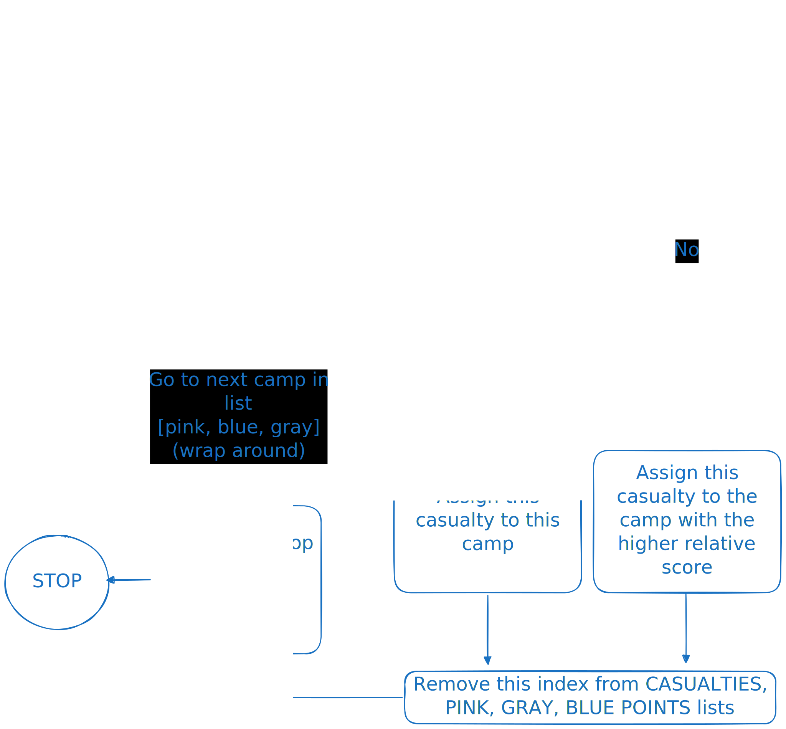

# UAS - DTU Recruitment Round 2
The task is given in the [PDF](./R2_TASK_UAS_DTU.pdf)

## Project directory tree
- The code for the task is in two files, `main.py` and `functions.py`. 
- All other code is in the directory `randomcode`, which is either stuff I wrote when learning OpenCV, or code I used to debug and test (`showimage.py` and `detectShapes.py`)

## How it works
### Variables
1. `CASUALTY_ASSIGNMENT_DEETS: dict[str, dict[str, list[tuple[int, int]]]]`
    - Example content:
    ```python
    {
        "imageName1.png": {
            "blue": [(agegrp1, severity1), ...],
            "pink": [(agegrp2, severity2), ...],
            "gray": [(agegrp3, severity3), ...],
        }, 
        "imageName2.png": {
            "blue": [(agegrp4, severity4), ...],
            "pink": [(agegrp5, severity5), ...],
            "gray": [(agegrp6, severity6), ...],
        }, 
        ...
    }
    ```
2. `CAMP_PRIORITY_SCORES_TOTAL: dict[str, dict[str, int]]`
    - Example content:
    ```python
    {
        "imageName1.png": {
            "blue": 12,
            "pink": 7,
            "gray": 10,
        },
        "imageName2.png": {
            "blue": 10,
            "pink": 15,
            "gray": 9,
        },
        ...
    }
    ```
3. `CAMP_PRIORITY_SCORES_AVG: dict[str, float]`
    - Example content:
    ```python
    {
        "1.png": 4.833333333333333,
        "2.png": 4.25,
        ...
    }
    ```

4. `CASUALTIES: list[tuple[tuple[int, int], int, int]]`
    - Specific to each imag
    - Given to `get_humans_and_camps` to populate, stores the coordinates of the centroids of the casualty markers, the age group, and the severity of the casualty. Example:
    ```python
    [((102, 485), 3, 3),
     ((460, 422), 3, 2),
     ((266, 416), 1, 3),
     ((262, 278), 2, 2),
     ((337, 132), 3, 1),
     ((192, 48), 2, 2)]
    ```

5. `CAMPS: dict[str, tuple[int, int]]`
    - Specific to each image
    - Given to `get_humans_and_camps` to populate, stores the coordinates of the centroids of the camps. Example:
    ```python
    {'blue': (57, 338), 'gray': (367, 215), 'pink': (81, 94)}
    ```

6. `PINK_POINTS`, `GRAY_POINTS`, `BLUE_POINTS`: `list[float]`
    - Returned from `get_priority_for_all_points`
    - Contains relative points wrt distance from camp for a casualty.

7. `FINAL_CAMP_ASSIGNMENT: dict[str, list[tuple[tuple[int, int], int, int, float]]]`
    - Stores coordinates of the casualty marker, age group, severity, relative points.
    - The dictionary's keys will be `pink`, `gray` and `blue`, and the value will be a list of the details of all the casualty markers, with their relative points.
    - Note that the info for the points will be stored in each list (`FINAL_CAMP_ASSIGNMENT['pink']`, `FINAL_CAMP_ASSIGNMENT['blue']`, `FINAL_CAMP_ASSIGNMENT['gray']`) at the same index as in `CASUALTIES`

### `functions.py`
The analysis of image is done using the functions in `functions.py`.
1. `ground_overlay`
    ```python
    def ground_overlay(img: np.ndarray) -> None:
    ...
    ```
    - Detects the ground portion in the parameter image and applies a yellow cover over it. Example:

    | Without overlay | With overlay |
    ----------------- | --------------
    |  | 

2. `get_humans_and_camps`
    ```python
    def get_humans_and_camps(
        img: np.ndarray,
        camps: dict[str, tuple[int, int]],
        casualties: list[tuple[tuple[int, int], int, int]],
    ) -> None:
        ...
    ```
    - Detects the contours (triangles, squares, stars and circles) and puts them in their respective variable.

3. `get_priority_for_all_points`
    ```python
    def get_priority_for_all_points(
        camps: dict[str, tuple[int, int]],
        casualties: list[tuple[tuple[int, int], int, int]],
    ) -> list[list[float]]:
    ```
    - Returns a list of 3 elements (1 for each camp) which themselves are lists of floating point values (relative priority scores for each casualty marker wrt the respective camp).
    - If the casualty marker is at $(x, y)$ and the respective camp is at $(x_1, y_1)$, and the casualty marker's age group is $a$ and severity is $s$ then the relative priority points is:

    $$\text{rel score} = \dfrac{a\cdot s}{\sqrt[4]{(x_1 - x) ^ 2 + (y_1 - y)^2}}$$

    $$\text{ie, rel score} = \dfrac{\text{age grp}\cdot\text{severity}}{\sqrt{\text{distance between the casualty and the camp}}}$$

### `main.py`
